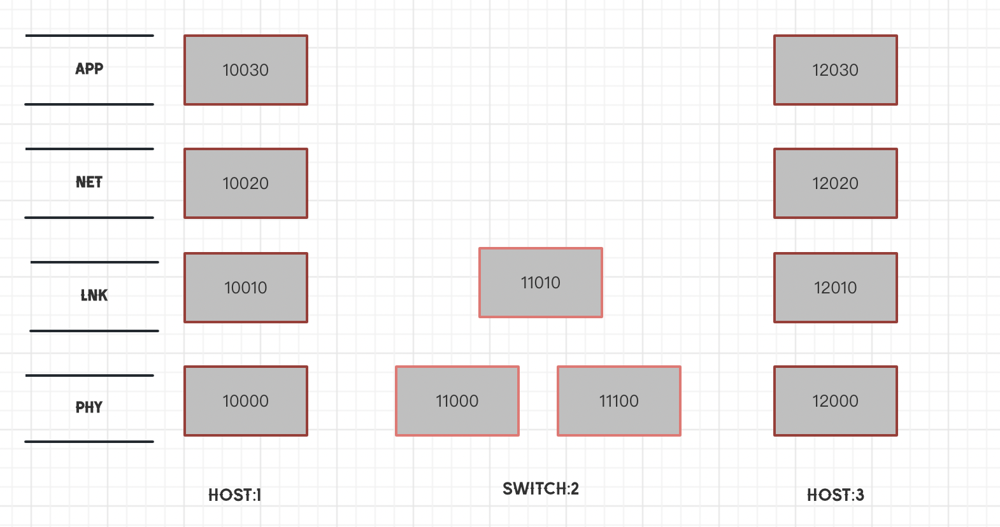

# 电子科技大学互联网+计算机与网络通信课程设计-最小网元设计

### 计划完成的功能：
- [x] 交换机设计
- [ ] 完善架构图（目前部分完善） 
- [ ] 路由器设计（慢慢重构补齐）

### 近期重构的缘由：

最近在写[mit-s6.824中的raft实验](https://github.com/xyjjyyy/mit-s6.824)的时候，发现raft实验中对于每一个节点peer的处理很值得我借鉴，他把每一个节点进行了包装，每一个节点都有自己的状态，自己的日志，自己的RPC服务，然后统一处理，让我觉得很巧妙，很适合这个实验！

不由得让我想起来当初编写这个最小网元设计实验的时候，我是如何处理每一个节点的，当初每次调试运行都要开好多个终端，即使采用了sh脚本自动化开启执行，也使得我调试很麻烦，有点本末倒置的意味，于是我就想着重构利用这个技巧重构一下这个实验，让它更加符合我现在的编码习惯，同时也让它更加符合我现在的编码水平。

### 当前交换机拓扑图：

